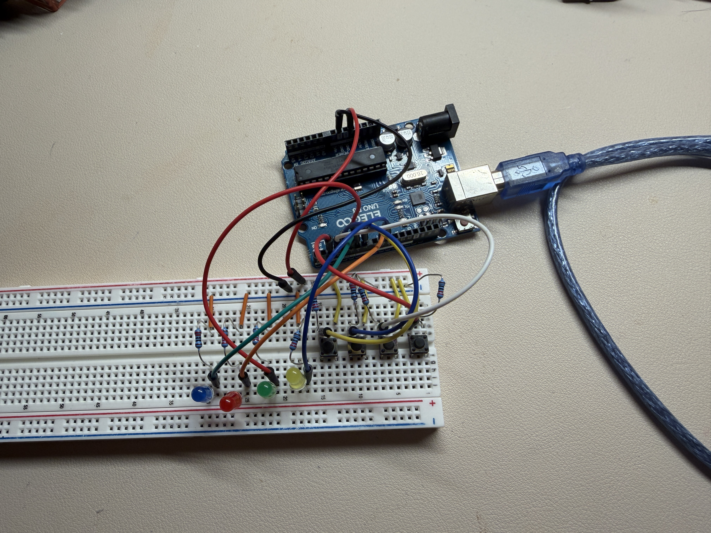

# LED Memory Game

## Project Idea & Interest:

I wanted to build on digital inputs and outputs, specifically buttons and LEDs. Instead of controlling one LED with one button, I wanted to use several of them together to create a game. My project is an LED memory game. Here is the general overview: The program is organized into different sections that control the lights, buttons, and game sequence. When the game starts, it creates a random sequence beginning with one light and flashes that pattern for the player to memorize. The player then repeats the pattern using the four matching buttons, and each press is checked against the original sequence. If the entire pattern is correct, the green light flashes and one new random light is added, making each round progressively harder. This continues until the sequence reaches a maximum of **20 lights**, at which point all the lights flash to show that the player has won. If the player presses the wrong button at any point, the red-light flashes and the game restarts with a new one-light sequence.

## New component

The main extension I added was the sequence and response system that allows the circuit to actually challenge your memory. I learned how to use an Arduino array to store a series of values, where each value from 0–3 represents one of the four LEDs and its matching button. Besides checking whether a button was pressed or not, the program compares each press with the value at the same position in the stored sequence. If every value matches, sequenceLength increases and random(0, 4) generates a new step without replacing the earlier pattern. If one value does not match, the comparison fails and the sequence resets to one as its length.

## Process:

I built the project by first separating it into smaller parts instead of trying to make the full game work at once. I started with one LED and one button, then added the remaining LEDs and buttons after checking that each base connection worked. Each LED was connected to a digital output pin through a resistor, while each button was connected to a digital input so the Arduino could detect which one was pressed. In the code, I first defined the pin numbers, then grouped the LEDs and buttons into arrays so the same logic could be reused for all four instead of writing separate code for a different colour. I used another array to store the sequence of lights, and a variable to keep track of how long the current sequence was. My program is separated into functions: one displays the sequence, one waits for the button to get pressed, and another compares each press to the stored pattern. I also added debouncing so one press on a button. would not be counted multiple times.

[https://docs.arduino.cc/language-reference/-](https://docs.arduino.cc/language-reference/-) I used this as reference when understanding arrays random(), digitalRead(), and digitalWrite()

[https://docs.arduino.cc/built-in-examples/control-structures/ifStatementConditional/-](https://docs.arduino.cc/built-in-examples/control-structures/ifStatementConditional/-) I used this as reference to understand if-statements.

[https://docs.arduino.cc/built-in-examples/control-structures/ForLoopIteration/?_gl=1*16yrt45*_up*MQ..*_ga*NjU5Mzk3NzU2LjE3OTAwNjIwMTk.*_ga_NEXN8H46L5*czE3OTAwNjIwMTYkbzEkZzAkdDE3OTAwNjIwMTYkajYwJGwwJGgxMjM0NzE2MzQ4](https://docs.arduino.cc/built-in-examples/control-structures/ForLoopIteration/?_gl=1*16yrt45*_up*MQ..*_ga*NjU5Mzk3NzU2LjE3OTAwNjIwMTk.*_ga_NEXN8H46L5*czE3OTAwNjIwMTYkbzEkZzAkdDE3OTAwNjIwMTYkajYwJGwwJGgxMjM0NzE2MzQ4)

-I used this so that my game repeatedly does the same action for multiple LEDs.

## Problem, Debugging & Iteration

The first major problem was that the LEDs could display the sequence, but none of the buttons would register when I pressed them. Since the LEDs were already responding to the program, I knew the Arduino was running the code, so I focused on the button instead of changing the code for sequencing. The first version of my code expected the buttons to send the opposite signal from how I had wired them. In my circuit, an unpressed button should read 0, while pressing it should change the reading to 1. I adjusted the input settings so the Arduino would read the signals according to the way the buttons were physically connected. When that still did not completely solve the problem, I temporarily removed the game logic and uploaded a smaller program for testing that printed the value of each button with digitalRead() in the Serial Monitor. This gave me a 0 or 1 for each input and let me test the four buttons individually. From there, I could check the pin assignments and wiring before putting the button code back into the full game. This was much more useful than repeatedly changing the full program because each test was checking one specific possible cause.

## Final Prototype:

## Peer Support:

When my buttons weren’t responding, Matthew helped me go through my wiring and check the connections carefully as I'm not experienced with hardware. He told me to trace each button from the Arduino pin to the breadboard instead of first assuming something was wrong with my code. That made it easier to figure out where the problem was and changed how I debugged the rest of the circuit.

## Reflection:

I could see this project being turned into a memory or learning game instead of just a pattern game. For example, each button could represent a different answer, and the Arduino could tell the student whether they chose correctly. To make that work, I would probably add a small screen for questions or instructions, have different difficulty levels, and a score that changes as the student answers. I would also need to change the code, so the buttons stand for actual answer choices instead of colours to advance it. If I kept working on the project, debugging would probably be the skill I would use the most, especially small mistakes from a loose wire to the wrong pin number as i am not familiar working with breadboards. I found that checking one part at a time worked much better than changing multiple things because you can narrow down the problem without messing up the other parts that had orginally worked.
